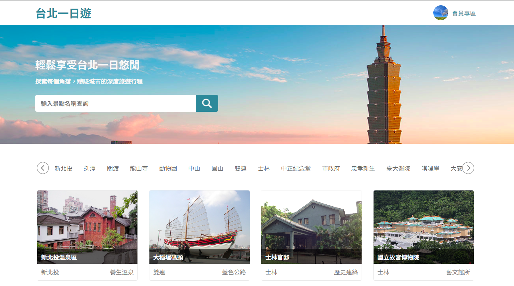
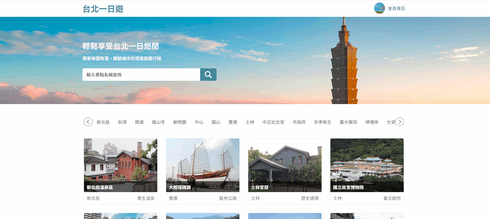
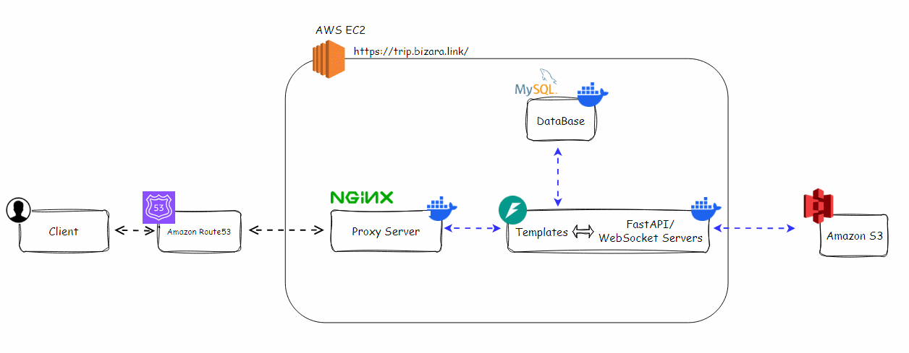

# Taipei Day Trip _- Taipei travel and tour booking website_
- **Demo Site**: https://trip.bizara.link/

  </img>

## Test

|   | Account | Password |
|--------|--------|----------|
| Test Account | `123@123.com` | `123` |

|   |  Card Number | Expiration | CVV |
|--------|--------|----------|----------|
| Valid Card | `4242 4242 4242 4242` | later than the current | `123` |
| Invalid Card | `4242 4288 2639 4242` | later than the current | `123` |

## Features
### Management(/member)

- **User Management:** Allow users to update profile information, including avatar uploads with AWS S3 integration.
- **Order Management:**  Record order history and support retry payment functionality.

  </img>

---

### Explore(/)
- **Search:** Enable dynamic display of attractions and support keyword search for quick filtering.
### Booking(/booking)
- **Taypay Integration:** Combine Taypay payment with the shopping cart for basic e-commerce support.

  </img>

---

## Tech Stack

- **Taipei Day Trip:**
  - **Backend:** FastAPI
  - **Frontend:** Jinja2(HTML,CSS,JavaScript)
  - **Database:** MySQL
- **Deploy and Environment:**
  - **Proxy Server:** Nginx
  - **Containerization:** Docker
  - **AWS Cloud Service:** EC2,S3,Route53

## Design Concept

### Architecture Design
- **Nginx Proxy:**  Reverse proxy to hide the specific addresses of backend containers, enhancing security and increasing flexibility.

  </img>

